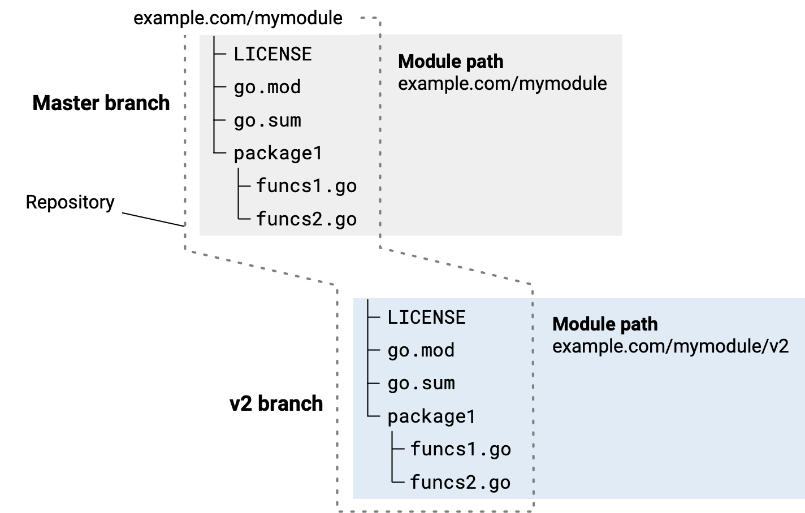

<!--{
  "Title": "开发主版本更新"
}-->

如果新版本中的变更无法保证对模块使用者向后兼容，就必须升级主版本。例如，修改模块的公共 API，导致使用旧版本的客户端代码无法继续正常工作，就属于这种情况。

> **注意：** 主版本、次版本、补丁版本和预发布版本，对模块使用者有不同的含义。使用者依靠这些区别判断新版本会给自身代码带来多大风险。因此，准备发布时，请确保版本号准确反映相较上一版本的变更性质。详情参见[模块版本号](/doc/modules/version-numbers)。

**另请参阅**

* 模块开发概览，参见[开发与发布模块](developing)。
* 完整流程，参见[模块发布与版本管理流程](release-workflow)。

## 主版本更新的注意事项 {#considerations}

只有在确有必要时，才应升级到新的主版本。主版本更新会给你和模块使用者带来大量调整工作。考虑主版本更新时，应注意以下几点：

* 向用户说明：发布新主版本后，旧主版本将获得怎样的支持。

  旧版本会被弃用吗？是否继续提供原有支持？是否继续维护旧版本，包括修复缺陷？

* 做好同时维护新旧两个版本的准备。例如，在一个版本中修复了缺陷，通常还需要将修复移植到另一个版本。

* 记住，从依赖管理的角度看，新主版本是一个新模块。发布后，用户需要改用新模块，而不只是升级已有依赖。

  这是因为新主版本的模块路径与上一主版本不同。例如，模块路径为 example.com/mymodule 时，其 v2 版本的模块路径应为 example.com/mymodule/v2。

* 开发新主版本时，凡是导入新模块中包的位置，都必须更新导入路径。模块使用者若要升级到新主版本，也必须更新自己的导入路径。

## 为主版本发布创建分支 {#branching}

准备开发新主版本时，最直接的源码管理方式，是从上一主版本的最新版本创建仓库分支。

例如，可以在命令行进入模块根目录，然后创建新的 v2 分支。

```
$ cd mymodule
$ git checkout -b v2
Switched to a new branch "v2"
```



创建分支后，需要对新版本源码进行以下修改：

* 在新版本的 go.mod 文件中，为模块路径追加新的主版本号，例如：
  * 现有版本：`example.com/mymodule`
  * 新版本：`example.com/mymodule/v2`

* 在 Go 代码中，更新所有导入该模块内包的路径，为路径中的模块部分追加主版本号。
  * 原导入语句：`import "example.com/mymodule/package1"`
  * 新导入语句：`import "example.com/mymodule/v2/package1"`

发布步骤参见[发布模块](/doc/modules/publishing)。
