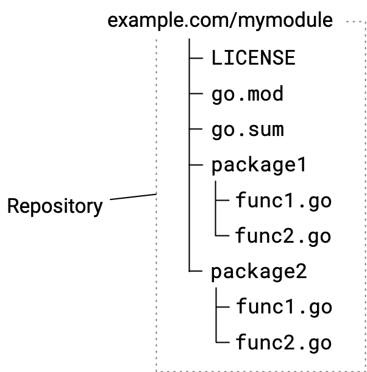
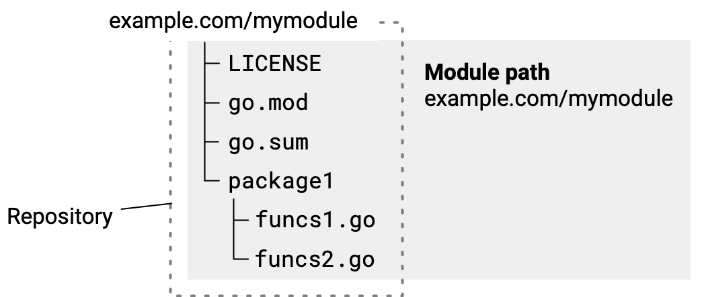
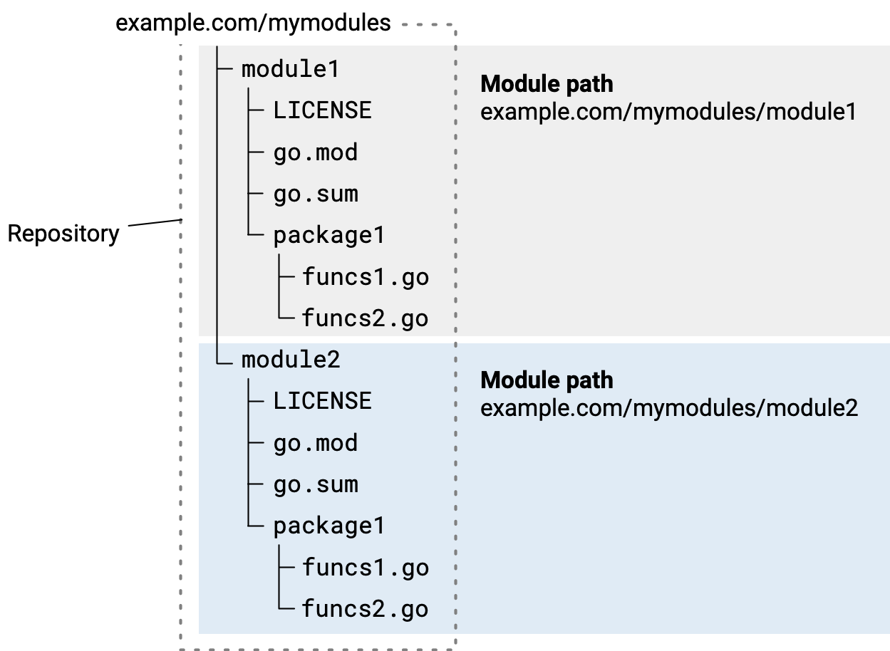

<!--{
  "Title": "管理模块源码"
}-->

开发供其他人使用的模块时，遵循本文介绍的仓库约定，可以让模块更便于其他开发者使用。

本文介绍管理模块代码仓库时可能需要执行的操作。关于模块版本迭代的工作流程，参见[模块发布与版本管理流程](release-workflow)。

这里的部分约定属于强制要求，另一些属于最佳实践。本文假定你已经熟悉[管理依赖](/doc/modules/managing-dependencies)中介绍的模块基本用法。

Go 支持使用以下版本控制系统发布模块：Git、Subversion、Mercurial、Bazaar 和 Fossil。

模块开发概览，参见[开发与发布模块](developing)。

## Go 工具如何找到已发布的模块 {#tools}

Go 的模块发布和代码获取体系是去中心化的。发布模块时，代码可以继续保留在你自己的仓库中。Go 工具依靠命名规则，通过仓库路径和标签确定模块名称与版本号。只要仓库符合这些要求，[`go get` 等命令](/ref/mod#go-get)就能从仓库下载模块代码。

开发者使用 `go get` 获取其代码所导入的包时，该命令执行以下操作：

1. 根据 Go 源码中的 `import` 语句，识别包路径中的模块路径。
1. 根据模块路径推导 URL，在模块代理服务器或源码仓库中定位模块源码。
1. 将模块版本号与仓库标签匹配，定位需要下载的版本。如果尚未确定版本号，`go get` 会查找最新的正式发布版本。
1. 获取模块源码，下载到开发者的本地模块缓存中。

## 在仓库中组织代码 {#repository}

遵循这里介绍的约定，可以简化维护工作，并改善开发者使用模块的体验。将模块代码纳入仓库通常与管理其他代码一样简单。

下图展示了一个包含两个包的简单模块的源码目录结构。



首次提交应包含下表列出的文件：

<table id="module-files" class="DocTable">
  <thead>
    <tr class="DocTable-head">
      <th class="DocTable-cell" width="20%">文件</th>
      <th class="DocTable-cell">说明</th>
    </tr>
  </thead>
  <tbody>
    <tr class="DocTable-row">
      <td class="DocTable-cell">LICENSE</td>
      <td class="DocTable-cell">模块的许可证。</td>
    </tr>
    <tr class="DocTable-row">
      <td class="DocTable-cell">go.mod</td>
      <td class="DocTable-cell"><p>描述模块，包括模块路径（也就是模块名）和依赖。详情参见 <a href="gomod-ref">go.mod 参考</a>。</p>
      <p>模块路径通过 module 指令指定，例如：</p>
      <pre>module example.com/mymodule</pre>
      <p>关于模块路径的选择，参见<a href="/doc/modules/managing-dependencies#naming_module">管理依赖</a>。</p>
      <p>虽然可以手动编辑 go.mod 文件，但通过 <code>go</code> 命令修改通常更可靠。</p>
      </td>
    </tr>
    <tr class="DocTable-row">
      <td class="DocTable-cell">go.sum</td>
      <td class="DocTable-cell"><p>记录模块依赖的密码学哈希值。Go 工具使用这些哈希值验证下载的模块，确认下载内容的真实性。如果验证失败，Go 会报告安全错误。</p>
      <p>没有依赖时，该文件可能为空或不存在。不要手动修改此文件；应通过 <code>go mod tidy</code> 等 Go 工具维护，其中 tidy 会移除不再需要的条目。</p>
      </td>
    </tr>
    <tr class="DocTable-row">
      <td class="DocTable-cell">包目录和 .go 源文件。</td>
      <td class="DocTable-cell">构成模块中各个 Go 包及源码的目录和 .go 文件。</td>
    </tr>
  </tbody>
</table>

可以从命令行创建空仓库，添加首次提交所需的文件，并附带提交说明完成提交。下面是使用 git 的示例：

```
$ git init
$ git add --all
$ git commit -m "mycode: initial commit"
$ git push
```

## 选择仓库范围 {#repository-scope}

当一部分代码需要独立于其他模块中的代码进行版本管理时，应将其作为模块发布。

让一个仓库只包含一个位于根目录的模块，有助于简化维护，尤其是在持续发布次版本、补丁版本，以及为新主版本创建分支时。不过，如果确有需要，也可以在一个仓库中维护多个模块。

### 一个仓库维护一个模块 {#one-module-source}

你可以用一个仓库维护单个模块的源码。在这种方式下，go.mod 文件位于仓库根目录，下面的包子目录中存放 Go 源文件。

这是最简单的方式，通常也更便于长期维护，同时无需在模块版本号前添加目录路径前缀。



### 一个仓库维护多个模块 {#multiple-module-source}

同一个仓库可以发布多个模块。例如，仓库中有几部分代码，分别构成不同模块，而且你希望单独管理它们的版本。

每个作为模块根目录的子目录，都必须有自己的 go.mod 文件。

模块代码位于子目录时，发布模块所用的版本标签格式也会改变。必须在标签的版本号部分前，加上模块根目录相对于仓库根目录的子目录路径。版本号的更多说明，参见[模块版本号](/doc/modules/version-numbers)。

例如，下面的模块 `example.com/mymodules/module1` 发布 v1.2.3 时，各项信息为：

* 模块路径：`example.com/mymodules/module1`
* 版本标签：`module1/v1.2.3`
* 用户导入的包路径：`example.com/mymodules/module1/package1`
* 用户 require 指令中的模块路径与版本：`example.com/mymodules/module1 v1.2.3`


