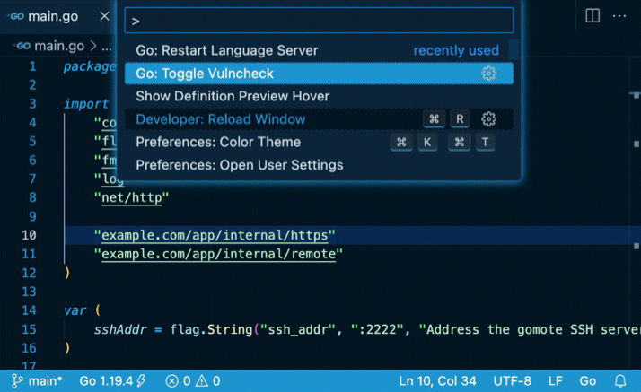

[返回 Go 安全](/security)

集成了 [Go 语言服务器](https://pkg.go.dev/golang.org/x/tools/cmd/gopls)的编辑器，例如[安装 Go 扩展的 VS Code](https://marketplace.visualstudio.com/items?itemName=golang.go)，可以检测依赖中的漏洞。

依赖漏洞检测有两种互补模式，都基于 [Go 漏洞数据库](https://vuln.go.dev)。

* 基于导入的分析：扫描工作区导入的包集合，在 `go.mod` 文件中显示诊断结果。速度较快，但可能产生误报，例如导入了包含漏洞符号的包，却无法从你的代码调用到存在漏洞的函数。可以通过 gopls 的 [`"vulncheck": "Imports"` 设置](https://github.com/golang/tools/blob/master/gopls/doc/settings.md#vulncheck-enum)启用。
* `Govulncheck` 分析：基于嵌入 `gopls` 的 [`govulncheck`](https://pkg.go.dev/golang.org/x/vuln/cmd/govulncheck) 命令行工具，以误报较少、可靠的方式确认代码是否实际调用了存在漏洞的函数。由于分析计算开销较大，需要手动触发：可以使用基于导入的分析诊断旁的“Run govulncheck to verify”代码操作，或 `go.mod` 文件上的 [`"codelenses.run_govulncheck"`](https://github.com/golang/tools/blob/master/gopls/doc/settings.md#run-govulncheck) CodeLens。

<div style="text-align: center;">

<em>Go: Toggle Vulncheck（切换漏洞检查）</em> <a
href="https://user-images.githubusercontent.com/4999471/206977512-a821107d-9ffb-4456-9b27-6a6a4f900ba6.mp4">(vulncheck.mp4)</a>
</div>

这些功能适用于 `gopls` v0.11.0 及更新版本。欢迎通过 [go.dev/s/vsc-vulncheck-feedback](/s/vsc-vulncheck-feedback) 提供反馈。

## 各编辑器的配置说明 {#editor-specific-instructions}

### VS Code {#vs-code}

[Go 扩展](https://marketplace.visualstudio.com/items?itemName=golang.go)提供与 gopls 的集成。启用漏洞扫描需要以下设置：

```
"go.diagnostic.vulncheck": "Imports", // enable the imports-based analysis by default.
"gopls": {
  "ui.codelenses": {
    "run_govulncheck": true  // "Run govulncheck" code lens on go.mod file.
  }
}
```

[“Go Toggle Vulncheck”命令](https://github.com/golang/vscode-go/wiki/Commands#go-toggle-vulncheck)可以开启或关闭当前工作区中基于导入的分析。

### Vim/NeoVim {#vimneovim}

使用 [coc.nvim](https://www.vim.org/scripts/script.php?script_id=5779) 时，以下设置可以启用基于导入的分析。

```
{
    "codeLens.enable": true,
    "languageserver": {
        "go": {
            "command": "gopls",
            ...
            "initializationOptions": {
                "vulncheck": "Imports",
            }
        }
    }
}
```

## 注意事项与限制 {#notes-and-caveats}

- 扩展不会扫描私有包，也不会发送私有模块的信息。它从 Go 漏洞数据库下载已知存在漏洞的模块列表，再在本地计算交集，完成分析。
- 基于导入的分析使用工作区模块中的包列表。使用 `go.work` 或 `replace`/`exclude` 时，这个列表可能与单独查看 `go.mod` 得到的结果不同。
- 修改代码或漏洞数据库更新后，govulncheck 分析结果可能过期。可以使用 `go.mod` 顶部的 `"Reset go.mod diagnostics"` CodeLens 手动清除结果；否则结果会在一小时后自动失效。
- 本文所述功能目前不报告标准库或工具链中的漏洞。Go 团队仍在研究如何展示这些结果，以及如何帮助用户处理相关问题。
