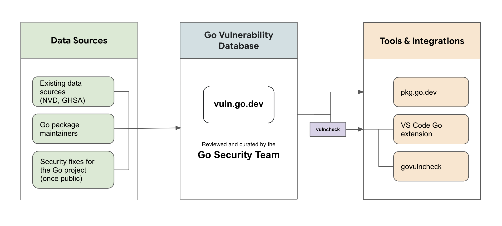

[返回 Go 安全](/security)

## 概述 {#overview}

Go 帮助开发者检测、评估并修复可能被攻击者利用的错误或薄弱点。Go 团队在后台运行一套处理流程，整理漏洞报告，并将其存入 Go 漏洞数据库。各种库和工具可以读取、分析这些报告，判断具体用户项目可能受到的影响。相关能力已经集成到 [Go 包检索网站](https://pkg.go.dev)和命令行工具 govulncheck 中。

本项目仍在持续开发和完善。欢迎提供[反馈](#feedback)，帮助我们改进！

**注意：**要报告 Go 项目中的漏洞，请参阅 [Go 安全策略](/security/policy)。

## 架构 {#architecture}

<div class="image">
  <center>
    </img>
  </center>
</div>

Go 漏洞管理主要包含以下部分：

1. **数据处理流程**从多个来源收集漏洞信息，包括[国家漏洞数据库（NVD）](https://nvd.nist.gov/)、[GitHub Advisory Database](https://github.com/advisories)，以及 [Go 包维护者直接提交的报告](/s/vulndb-report-new)。
2. **漏洞数据库**根据处理流程收集的信息生成报告。数据库中的所有报告均由 Go 安全团队审查和整理。报告采用[开源漏洞（OSV）格式](https://ossf.github.io/osv-schema/)，可通过 [API](/security/vuln/database#api) 访问。
3. 与 [pkg.go.dev](https://pkg.go.dev) 和 govulncheck **集成**，帮助开发者发现项目中的漏洞。[govulncheck 命令](https://pkg.go.dev/golang.org/x/vuln/cmd/govulncheck)会分析代码库，根据代码中的函数是否直接或间接调用存在漏洞的函数，仅报告实际影响项目的漏洞。它提供了一种噪声低、可靠的已知漏洞检测方式。

## 资源 {#resources}

### Go 漏洞数据库 {#go-vulnerability-database}

[Go 漏洞数据库](https://vuln.go.dev)汇集了许多现有来源的信息，以及 Go 包维护者直接向 Go 安全团队提交的报告。数据库中的每个条目都会经过审查，以确保漏洞描述、包与符号信息、版本细节准确。

有关 Go 漏洞数据库的更多信息，请参阅 [go.dev/security/vuln/database](/security/vuln/database)。也可以在浏览器中访问 [pkg.go.dev/vuln](https://pkg.go.dev/vuln)，查看数据库中的漏洞。

我们鼓励包维护者[贡献](#feedback)自己项目中已公开漏洞的信息，并[提出建议](/s/vuln-feedback)，帮助简化报告流程。

### Go 漏洞检测 {#vulnerability-detection-for-go}

Go 漏洞检测旨在提供噪声低、可靠的方式，帮助用户了解可能影响其项目的已知漏洞。漏洞检查已集成到 Go 工具和服务中，包括命令行工具 [govulncheck](https://pkg.go.dev/golang.org/x/vuln/cmd/govulncheck)、[Go 包检索网站](https://pkg.go.dev)，以及安装了 Go 扩展的 VS Code 等[主流编辑器](/security/vuln/editor)。

要开始使用 govulncheck，请在项目中运行：

```
$ go install golang.org/x/vuln/cmd/govulncheck@latest
$ govulncheck ./...
```

要在编辑器中启用漏洞检测，请按照[编辑器集成](/security/vuln/editor)页面的说明操作。

### Go CNA {#go-cna}

Go 安全团队是一个 [CVE 编号分配机构](https://www.cve.org/ProgramOrganization/CNAs)。详情请参阅 [go.dev/security/vuln/cna](/security/vuln/cna)。

## 反馈 {#feedback}

欢迎通过以下方式参与并帮助我们改进：

- 为你维护的 Go 包[新增已公开漏洞的信息](/s/vulndb-report-new)，或[更新已有信息](/s/vulndb-report-feedback)。
- [填写问卷](/s/govulncheck-feedback)，分享使用 govulncheck 的体验。
- [反馈问题和功能需求](/s/vuln-feedback)。

## 常见问题 {#faqs}

**如何报告 Go 项目中的漏洞？**

Go 项目中的所有安全缺陷都应通过邮件报告至 [security@golang.org](mailto:security@golang.org)。有关处理流程，详见 [Go 安全策略](/security/policy)。

**如何将已公开漏洞加入 Go 漏洞数据库？**

要申请添加已公开漏洞，请[填写此表单](/s/vulndb-report-new)。

漏洞已被公开披露，或者位于你维护的包中且你已准备好披露时，就视为公开漏洞。该表单仅用于可导入、且不由 Go 团队维护的 Go 包中的公开漏洞，即不属于 Go 标准库、Go 工具链和 golang.org 模块的漏洞。

也可以通过该表单申请新的 CVE 编号。有关 Go CVE 编号分配机构，请[阅读这里的说明](/security/vuln/cna)。

**如何建议修改漏洞信息？**

要建议修改 Go 漏洞数据库中的现有报告，请[填写此表单](/s/vulndb-report-feedback)。

**如何报告 govulncheck 的问题或提出反馈？**

请在 [Go 问题跟踪系统](/s/vuln-feedback)中提交问题或反馈。

**其他数据库中有这个漏洞，为什么 Go 漏洞数据库没有？**

报告可能因多种原因被排除，例如漏洞不在 Go 包中、漏洞位于可安装的命令而不是可导入的包中，或者已被数据库中另一个漏洞报告涵盖。详情请参阅 Go 安全团队[排除报告的原因](/security/vuln/database#excluded-reports)。如果认为某个报告被错误地排除在 vuln.go.dev 之外，请[告知我们](/s/vulndb-report-feedback)。

**为什么 Go 漏洞数据库不使用严重程度标签？**

大多数漏洞报告格式使用“LOW”“MEDIUM”“CRITICAL”等严重程度标签，表示不同漏洞的影响，并帮助开发者安排安全问题的处理优先级。不过，Go 出于以下原因避免使用这些标签。

漏洞的影响很少对所有用户都相同，因此严重程度指标往往可能产生误导。例如，如果解析器用于解析用户提供的输入，崩溃可能被用于拒绝服务（DoS）攻击，此时影响可能十分严重；但如果只是解析本地配置文件，即使将其评为“低”严重程度，也可能言过其实。

严重程度标注也不可避免地带有主观性。即使是 [CVE 计划](https://www.cve.org/About/Overview)所讨论的评分方法，将攻击向量、复杂度和可利用性等因素分别评估，也仍然需要主观判断。

我们认为，优质的漏洞描述比严重程度指标更有用。清晰的描述可以说明问题是什么、如何触发，以及使用者评估对自身软件的影响时应考虑什么。

如果希望分享你对这一话题的看法，欢迎[提交问题](/s/vuln-feedback)。
