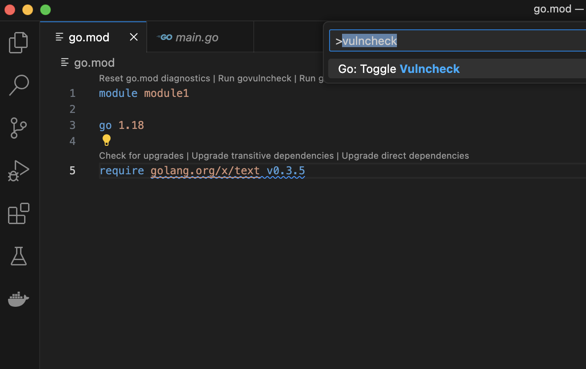
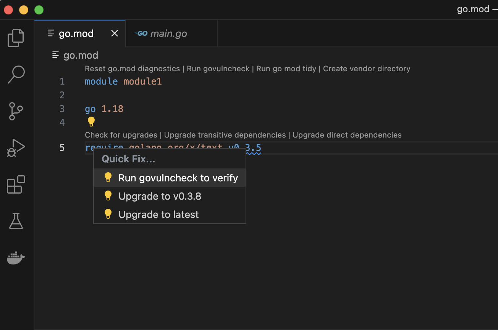
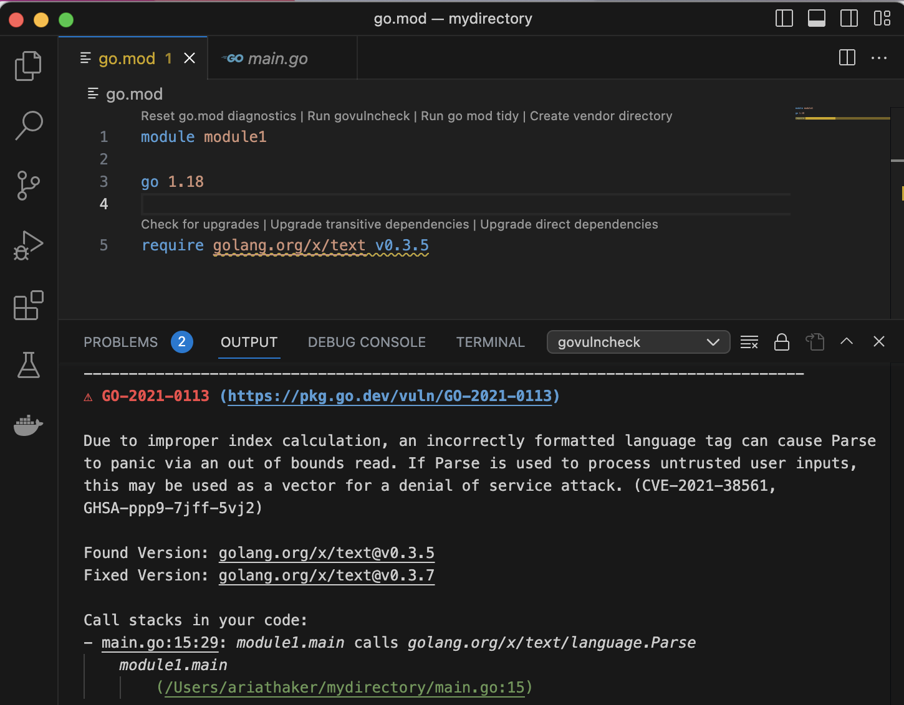
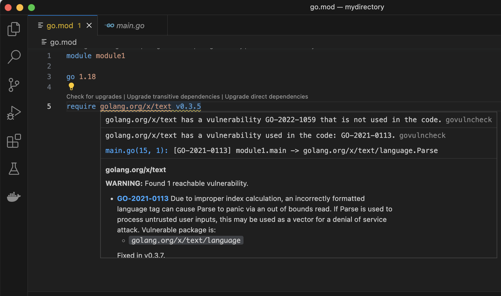
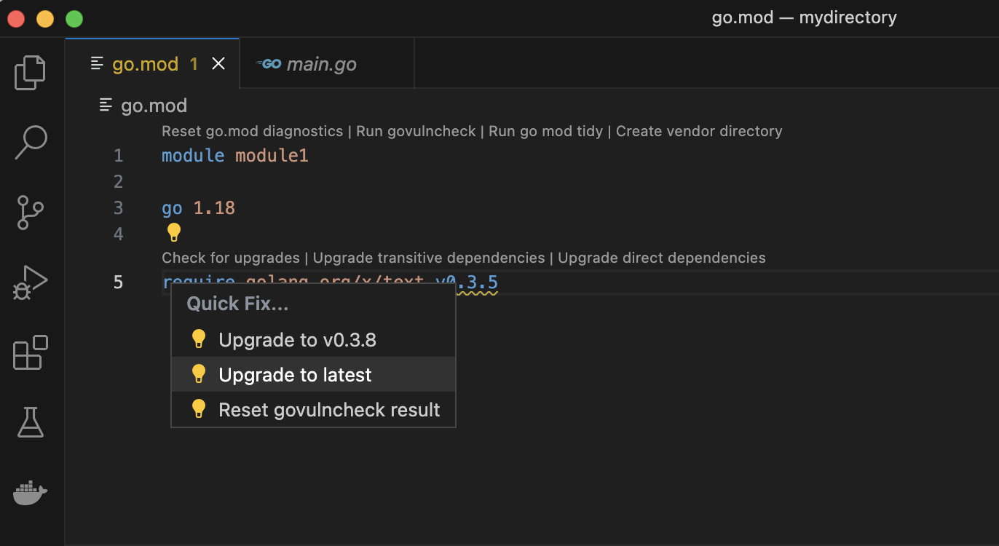

<!--{
  "Title": "教程：使用 VS Code Go 查找并修复存在漏洞的依赖",
  "Breadcrumb": true
}-->

[返回 Go 安全](/security)

借助 Visual Studio Code 的 Go 扩展，你可以直接在编辑器中扫描代码中的漏洞。

注意：下方截图中所示漏洞修复的详细说明，请参阅 [govulncheck 教程](/doc/tutorial/govulncheck)。

## 准备工作 {#prerequisites}

- **Go。**建议使用最新版本的 Go 学习本教程。安装步骤请参阅[安装 Go](/doc/install)。
- **VS Code**，并更新到最新版本。[在此下载](https://code.visualstudio.com/)。也可以使用 Vim（详见[相关说明](/security/vuln/editor#editor-specific-instructions)），但本教程主要介绍 VS Code Go。
- **VS Code Go 扩展**，可以[在此下载](https://marketplace.visualstudio.com/items?itemName=golang.go)。
- **编辑器相关设置。**需要按照[这些要求](/security/vuln/editor#editor-specific-instructions)修改开发环境设置，才能复现下面的效果。

## 使用 VS Code Go 扫描漏洞 {#how-to-scan-for-vulnerabilities-using-vs-code-go}

**第 1 步。**运行 "Go: Toggle Vulncheck"。

[Toggle Vulncheck](https://github.com/golang/vscode-go/wiki/Commands#go-toggle-vulncheck) 命令会显示模块中列出的所有依赖的漏洞分析结果。要使用这个命令，请在开发环境中打开[命令面板](https://code.visualstudio.com/docs/getstarted/userinterface#_command-palette)（Linux/Windows 使用 Ctrl+Shift+P，Mac OS 使用 Cmd+Shift+P），然后运行“Go: Toggle Vulncheck”。在 go.mod 文件中，你会看到代码直接或间接使用的、存在漏洞的依赖的诊断信息。

<div class="image">
  <center>
    </img>
  </center>
</div>

注意：要在自己的编辑器中复现本教程，请将以下代码复制到 main.go 文件中。

```
// This program takes language tags as command-line
// arguments and parses them.

package main

import (
  "fmt"
  "os"

  "golang.org/x/text/language"
)

func main() {
  for _, arg := range os.Args[1:] {
    tag, err := language.Parse(arg)
    if err != nil {
      fmt.Printf("%s: error: %v\n", arg, err)
    } else if tag == language.Und {
      fmt.Printf("%s: undefined\n", arg)
    } else {
      fmt.Printf("%s: tag %s\n", arg, tag)
    }
  }
}
```

然后，确保程序对应的 go.mod 文件如下所示：

```
module module1

go 1.18

require golang.org/x/text v0.3.5
```

接着运行 `go mod tidy`，更新 go.sum 文件。

**第 2 步。**通过代码操作运行 govulncheck。

通过代码操作运行 govulncheck，可以重点检查代码中实际调用到的依赖。VS Code 用灯泡图标表示代码操作：将鼠标悬停在相关依赖上查看漏洞信息，然后选择“Quick Fix（快速修复）”打开选项菜单，再选择“run govulncheck to verify”。相关的 govulncheck 输出会显示在终端中。

<div class="image">
  <center>
    </img>
  </center>
</div>

<div class="image">
  <center>
    </img>
  </center>
</div>

**第 3 步。**将鼠标悬停在 go.mod 文件列出的某个依赖上。

将鼠标悬停在 go.mod 文件中的依赖上，也能查看 govulncheck 针对该依赖给出的结果。如果只是想快速查看依赖信息，这种方式比使用代码操作更方便。

<div class="image">
  <center>
    </img>
  </center>
</div>

**第 4 步。**将依赖升级到已修复漏洞的版本。

代码操作也能帮助你快速升级到修复了漏洞的依赖版本。只需在代码操作的下拉菜单中选择“Upgrade（升级）”。

<div class="image">
  <center>
    </img>
  </center>
</div>

## 更多资源 {#additional-resources}

- 关于在开发环境中扫描漏洞的更多说明，请参阅[这个页面](/security/vuln/editor)。其中的[说明与注意事项](/security/vuln/editor#notes-and-caveats)讨论了一些特殊情况；这些情况下的漏洞扫描可能比上面的示例更复杂。
- [Go 漏洞数据库](https://pkg.go.dev/vuln/)既包含 Go 包维护者直接向 Go 安全团队报告的漏洞，也汇总了许多其他来源的信息。
- [Go 漏洞管理](/security/vuln/)页面从整体上介绍了 Go 检测、报告和管理漏洞的架构。
