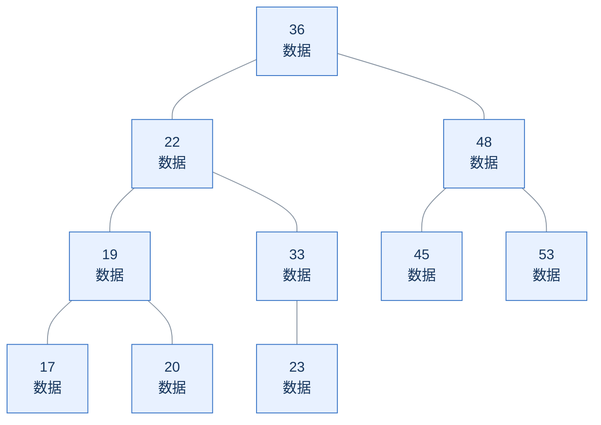

# 索引概述

## 1. 介绍

**索引（Index）是数据库为提高数据检索效率而维护的数据结构（如 B+ 树、Hash）。** 数据库在存储表结构和数据之外，还维护这个索引数据结构，使其直接或间接地引用（指向）对应的数据记录，避免了低效的全表扫描，从而实现数据的高效定位与获取。

## 2. 演示

查询年龄为 45 的用户：

```sql
SELECT * FROM user WHERE age = 45;
```

示例数据（地址仅用于示意）：

| 示意地址 | id | name | age |
| --- | --- | --- | --- |
| 0x07 | 1 | 金庸 | 36 |
| 0x56 | 2 | 张无忌 | 22 |
| 0x6A | 3 | 杨逍 | 33 |
| 0xF3 | 4 | 韦一笑 | 48 |
| 0x90 | 5 | 常遇春 | 53 |
| 0x77 | 6 | 小昭 | 19 |
| 0xD1 | 7 | 灭绝 | 45 |
| 0x32 | 8 | 周芷若 | 17 |
| 0xE5 | 9 | 丁敏君 | 23 |
| 0xF2 | 10 | 赵敏 | 20 |

1. 无索引：没有可用于该条件的索引时，通过全表扫描逐行判断 age 是否为 45。
2. 有索引：按照图中的二叉树示意，查找路径为 36 → 48 → 45，
   再通过索引指向的数据找到 id = 7、name = '灭绝'、age = 45 的记录。

二叉树示意（节点中的数字为 age）：



查找 age = 45：45 > 36，向右找到 48；45 < 48，向左找到 45。

备注：上述二叉树索引结构只是一个示意图，并不是真实的索引结构。

## 3. 索引的优缺点：

### 优势

1. 提高数据检索的效率，降低数据库的 I/O 成本。
2. 通过索引列对数据进行排序，降低数据排序的成本，降低 CPU 的消耗。

### 劣势

1. 索引也需要占用存储空间。
2. 索引虽然提高查询效率的同时，但对表进行 INSERT、UPDATE、DELETE 操作时，需要维护相关索引，效率会受到影响。
