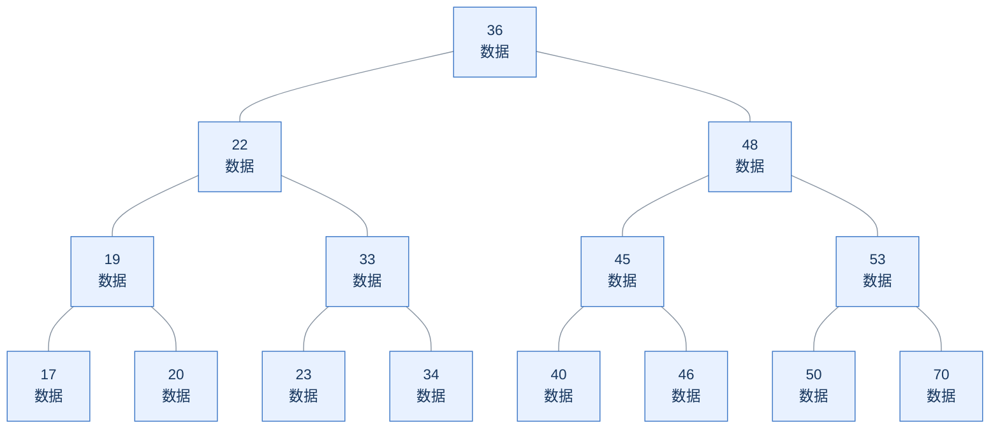
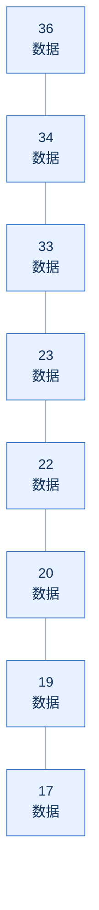
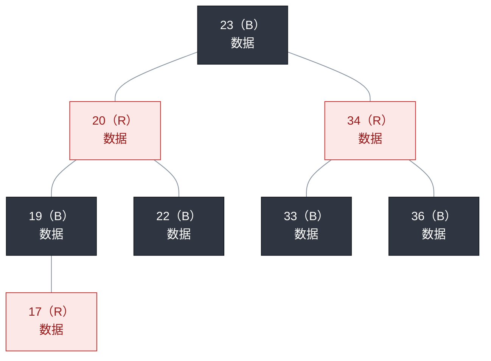
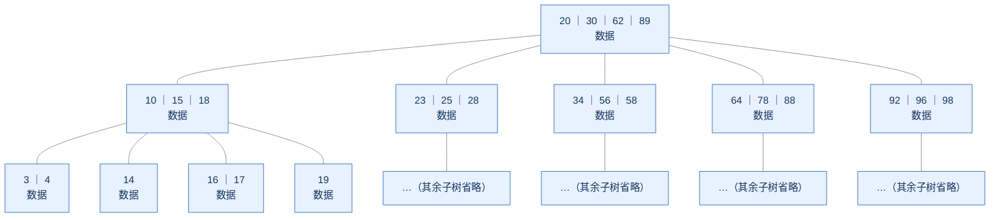
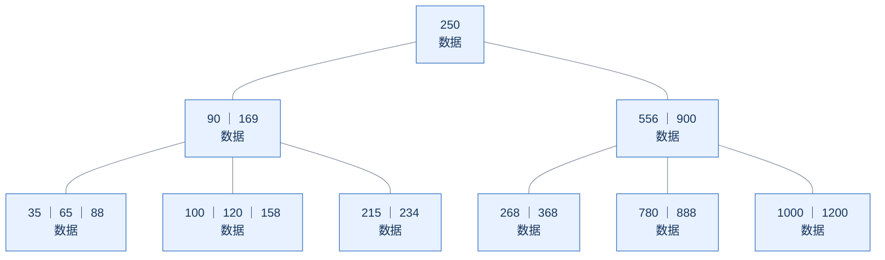
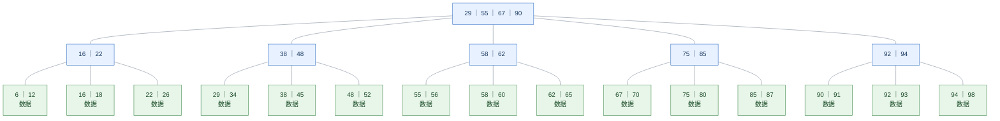
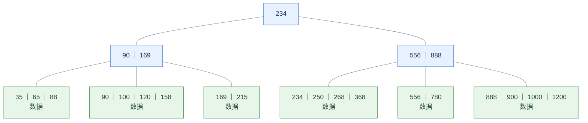
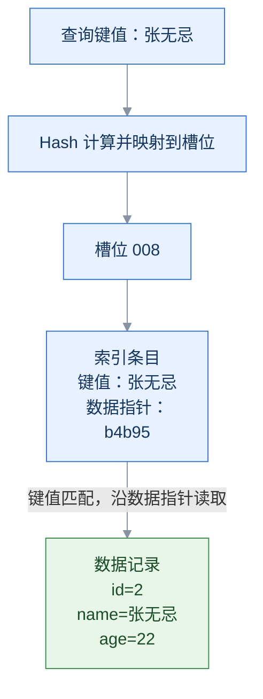
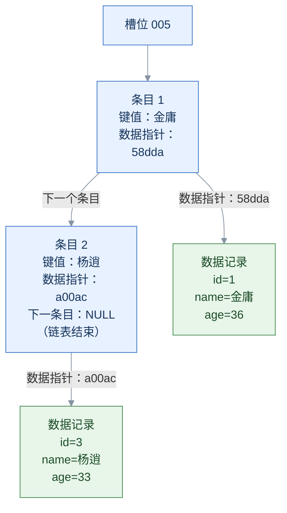

# 索引结构

MySQL 的索引是在存储引擎层实现的，不同的存储引擎有不同的索引结构，主要包含以下几种：

| 索引结构 | 描述 |
| --- | --- |
| B+Tree 索引 | 最常见的索引类型，大部分存储引擎都支持 B+ 树索引。 |
| Hash 索引 | 底层使用哈希表实现，只有精确匹配索引列的查询才有效，不支持范围查询。 |
| R-tree（空间索引） | 主要用于地理空间数据类型，通常使用较少；MyISAM 和较新版本的 InnoDB 均支持。 |

## 不同存储引擎对索引的支持情况：

| 索引 | InnoDB | MyISAM | Memory |
| --- | --- | --- | --- |
| B+Tree 索引 | 支持 | 支持 | 支持 |
| Hash 索引 | 不支持用户直接创建，但引擎内部有**自适应哈希索引**机制 | 不支持 | 支持 |
| R-tree 索引 | 支持（MySQL 5.7 起） | 支持 | 不支持 |

我们平常所说的索引，如果没有特别指明，通常是指 B+ 树结构组织的索引。


## 图例与阅读方式

树形结构使用 Mermaid 图表；在支持 Mermaid 的 Markdown 预览器中可直接查看。

| 图中表示 | 含义 |
| --- | --- |
| 蓝色节点 | 索引节点，框内数字为键值；是否携带数据，以节点中的“数据”文字为准。 |
| 绿色节点 | B+Tree 的叶子节点或 Hash 示例中的数据记录。 |
| 红色 / 深灰色节点 | 红黑树的红 / 黑节点，同时用 `R` / `B` 标注。 |
| 灰色实线 | 树中父节点与子节点之间的指针关系。 |
| 带箭头的连线 | Hash 查找方向或索引条目之间的链接，具体含义见连线文字。 |
| `｜` | 分隔同一节点中的多个键值。 |
| `数据` | 该节点保存对应数据，具体内容省略。 |
| `->` / `<->` | 叶子节点之间的单向 / 双向链接，单独列在树形图下方。 |

**阅读重点：**

​	二叉查找树、红黑树和 B-Tree 的各节点均标注“数据”；B+Tree 只在叶子节点标注“数据”。

​	颜色用于辅助辨认，节点文字也能独立表达含义。


## 为什么索引结构使用 B+Tree，而不使用二叉查找树、红黑树、B-Tree？

这里讨论的是：为什么 InnoDB 的默认索引选择 B+Tree。这几种树并非不能用于索引，而是在大数据量、按页读写和范围查询的场景下，B+Tree 通常更合适。

### 1. 普通二叉查找树：可能退化为链表

二叉查找树的每个节点最多有两个子节点，左子树的键值小于当前节点，右子树的键值大于当前节点。

#### 二叉查找树示意



#### 顺序插入后退化为链表

例如按从大到小的顺序插入：36、34、33、23、22、20、19、17。



查询 `17` 时，需要从 `36` 开始沿链逐个比较。数据量为 n 时，最坏情况下查询的时间复杂度为 `O(n)`。

**问题：缺少自动平衡机制，查询性能容易受到插入顺序的影响。**


### 2. 红黑树：解决了平衡问题，但分支仍然较少

#### 红黑树示意（B 表示黑色节点，R 表示红色节点）



虽然它的自动平衡机制避免二叉树退化为链表，每个节点最多仍只有两个子节点。数据量较大时，相比多路查找树仍可能层级较深，不利于数据库检索。

**问题：自动平衡机制解决了退化，但没有解决二叉结构分支少、树较高的问题。**


### 3. B-Tree（多路平衡查找树）：已经是多路平衡树，但 B+Tree 更适合范围访问

以最大度数（max-degree）为 5 的 B-Tree（5 阶）为例：每个节点最多存储 4 个 key，最多有 5 个指向子节点的指针。



知识小贴士：**节点的度数**是该节点的子节点个数，**树的度数**是所有节点度数的最大值。

#### B-Tree 插入示例：

按以下顺序插入数据：
100、65、169、368、900、556、780、35、215、1200、234、888、158、90、1000、88、120、268、250。

图中最终结构：



为什么不使用 B-Tree，主要有以下区别：

1. **内部节点可容纳的分支数。**在页大小、键值大小等条件相同的情况下，B-Tree 内部节点还要保存对应的数据或记录引用，会占用额外空间。B+Tree 内部节点只保存用于导航的键值和子节点指针，通常可以容纳更多分支，使树更矮。
2. **范围查询的遍历方式。**B-Tree 的数据分布在各层节点中，范围查询需要按序遍历树，可能在父子节点之间移动。B+Tree 的数据条目集中在叶子节点，叶子节点按键值顺序链接；找到范围起点后，可以沿叶子节点依次扫描。


## 为什么使用 B+Tree 

以最大度数（max-degree）为 5 的 B+Tree（5 阶）为例，按下图的表示方式，每个内部节点（非叶子节点）最多存储 4 个 key，最多有 5 个指向子节点的指针。



**叶子节点单向链接（从左到右）：**

```text
[6|12] -> [16|18] -> [22|26] -> [29|34] -> [38|45] -> [48|52] -> [55|56] -> [58|60] -> [62|65] -> [67|70] -> [75|80] -> [85|87] -> [90|91] -> [92|93] -> [94|98]
```

非叶子节点只存储用于导航的索引键值和子节点指针，不存储数据记录；叶子节点存储键值及对应数据。

### B+Tree 插入示例

按以下顺序插入数据：
100、65、169、368、900、556、780、35、215、1200、234、888、158、90、1000、88、120、268、250。

图中最终结构：



**叶子节点单向链接（从左到右）：**

```text
[35|65|88] -> [90|100|120|158] -> [169|215] -> [234|250|268|368] -> [556|780] -> [888|900|1000|1200]
```

与 B-Tree 相比，主要有以下区别：

1. 所有数据都会出现在叶子节点，非叶子节点只用于导航。
2. 图中的叶子节点按键值顺序形成单向链表，便于顺序遍历和范围查询。

### MySQL 中的 B+Tree 和常规的 B+Tree 有点区别

以 InnoDB 为例，叶子节点（页）之间通过前后指针双向连接，这样双向链接便于向前、向后访问相邻叶子页，提高区间访问的性能。

沿用前文 B+Tree 的树形结构，图下用 `<->` 表示相邻叶子页之间的双向链接：


**叶子节点双向链接（从左到右）：**

```text
[6|12] <-> [16|18] <-> [22|26] <-> [29|34] <-> [38|45] <-> [48|52] <-> [55|56] <-> [58|60] <-> [62|65] <-> [67|70] <-> [75|80] <-> [85|87] <-> [90|91] <-> [92|93] <-> [94|98]
```


## Hash 索引原理

哈希索引采用一定的 Hash 算法，将键值换算成 Hash 值，映射到对应的槽位，并存储在哈希表中。
如果两个或多个键值映射到同一个槽位，就会产生 Hash 冲突（也称 Hash 碰撞），可以通过链表解决。

### 1. 示例数据（按 name 字段建立 Hash 索引，地址仅为示意）

| 示意地址 | id | name | age |
| --- | --- | --- | --- |
| 58dda | 1 | 金庸 | 36 |
| b4b95 | 2 | 张无忌 | 22 |
| a00ac | 3 | 杨逍 | 33 |
| 13725 | 4 | 韦一笑 | 48 |
| b4a96 | 5 | 常遇春 | 53 |
| 0305a | 6 | 小昭 | 19 |
| 48c00 | 7 | 灭绝 | 45 |
| f2d22 | 8 | 周芷若 | 17 |
| e29fd | 9 | 丁敏君 | 23 |
| a7b7d | 10 | 赵敏 | 20 |
| 4af6d | 11 | 鹿杖客 | 49 |
| 00a22 | 12 | 鹤笔翁 | 60 |

### 2. 先看没有冲突的情况：查询“张无忌”



槽位负责找到索引条目；索引条目保存键值和数据指针；数据指针用于找到完整的数据记录。
这里的地址仅为示意，不是 Hash 值，也不是槽位编号。

### 3. 再看发生冲突的情况：金庸和杨逍都映射到槽位 005

| 查询键值 | Hash 映射后的槽位 |
| --- | --- |
| 金庸 | `005` |
| 杨逍 | `005` |

同一个槽位下有两个索引条目，通过“下一个条目”指针连接：



查询“杨逍”的过程：

1. 对 **杨逍** 进行 Hash 计算，定位槽位 005。
2. 比较条目 1 的 **金庸**，不匹配，沿“下一个条目”指针继续查找。
3. 比较条目 2 的 **杨逍**，匹配，再沿数据指针 `a00ac` 读取对应数据记录。

**注意区分两种指针：**数据指针指向表中的记录；“下一个条目”指针连接同一槽位中的索引条目。
Hash 冲突只是落入同一槽位，不代表两个键值相同，也不会把两条记录合并。

### 4. 图中其他映射（省略空槽位）

| 查询键值 | Hash 映射后的槽位 | 数据指针（示意地址） |
| --- | --- | --- |
| 常遇春 | `002` | `b4a96` |
| 韦一笑 | `010` | `13725` |
| 小昭 | `101` | `0305a` |

## Hash 索引特点与存储引擎支持

### 1. Hash 索引特点

1. 只能用于等值比较（如 `=`、`IN`），不支持范围查询（如 `BETWEEN`、`>`、`<`）。
2. 无法利用 Hash 索引完成排序操作。
3. 等值查询效率高，通常可通过一次 Hash 计算定位槽位；冲突较少时，可能比 B+Tree 查找更快。
   发生冲突后仍需比较槽位中的键值，实际效率取决于数据分布和冲突情况。

### 2. 存储引擎支持

MEMORY 引擎支持 Hash 索引。
InnoDB 不支持用户直接创建 Hash 索引，但具有自适应哈希索引（Adaptive Hash Index）功能。
该功能启用时，存储引擎会根据访问情况，在满足条件时基于 B+Tree 索引自动构建哈希索引。


## 总结：为什么 InnoDB 存储引擎选择使用 B+Tree 索引结构？

### 1. 相对于二叉树

B+Tree 的一个节点可以有多个子节点，存储相同数量的数据时，通常层级更少，磁盘 I/O 更少，搜索效率更高。

### 2. 相对于 B-Tree

B-Tree 的非叶子节点和叶子节点都会保存数据。
在页大小相同的情况下，数据会占用页空间，使每页能存储的键值和子节点指针减少。
这样 B-Tree 要保存同样多的数据，树可能更高，查询需要访问更多页。
B+Tree 的非叶子节点只保存索引键值和子节点指针，可以容纳更多键值和指针，有利于降低树的高度。

### 3. 相对于 Hash 索引

B+Tree 的键值有序，且叶子节点之间通过链表连接，支持范围匹配及利用索引顺序完成排序。
Hash 索引适合等值查找，不支持范围查询，也无法利用其完成排序。
