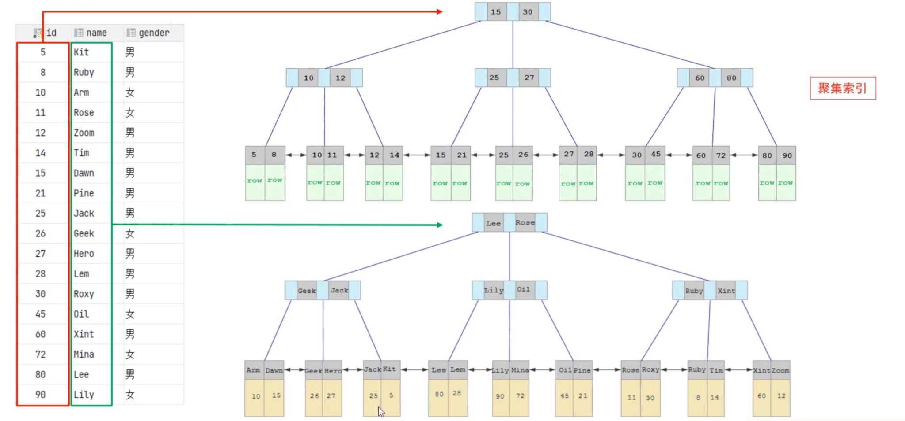
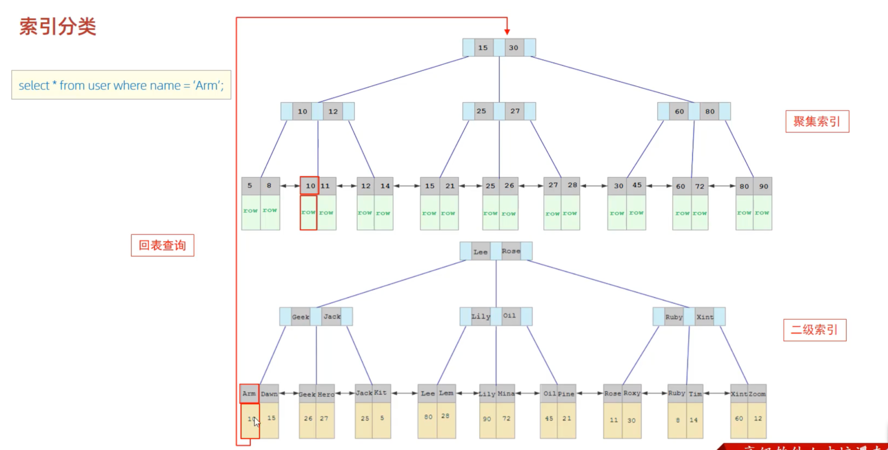
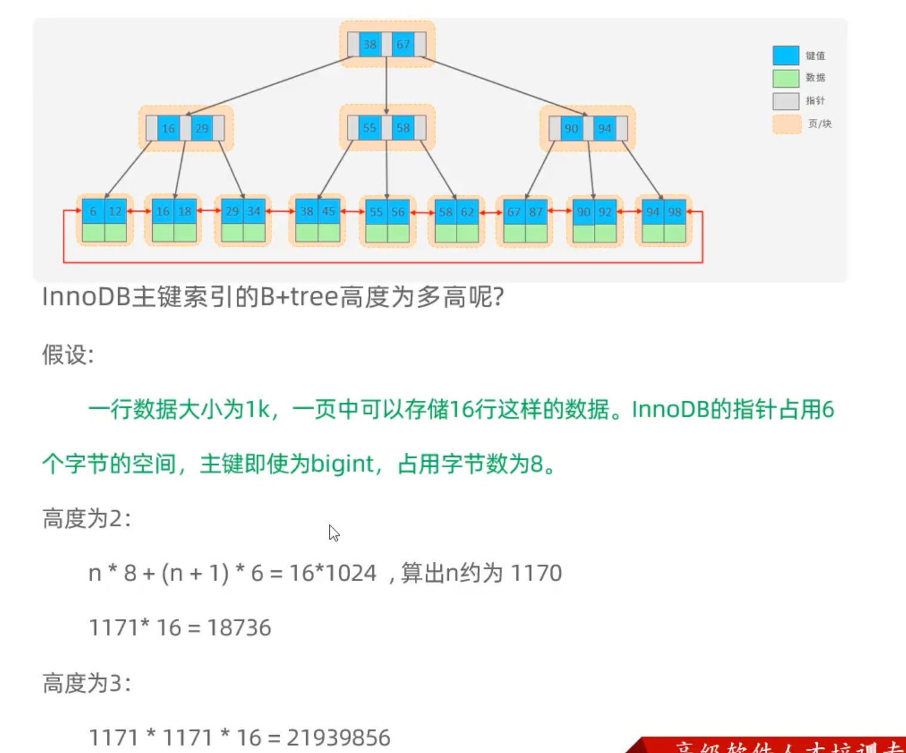

# 索引分类

上一章节介绍索引按底层数据结构划分有哪些类型。

为了便于学习，接下来先聚焦 **InnoDB 中的 B+Tree 索引**：按用途与约束，理解主键索引、唯一索引、常规索引、全文索引；按存储形式，理解聚集索引、二级索引。

索引结构和索引用途是不同的描述角度。同一种结构可以用于实现不同用途的索引，同一种用途也可能采用不同结构实现，具体取决于存储引擎的支持和实现方式。

## 按用途与约束划分

| 分类 | 含义 | 特点 | 关键字 |
| --- | --- | --- | --- |
| 主键索引 | 针对表中主键创建的索引 | 定义主键时自动创建，一张表只能有一个 | PRIMARY KEY |
| 唯一索引 | 避免同一张表中索引列（或列组合）的值重复 | 可以有多个 | UNIQUE |
| 常规索引 | 快速定位特定数据 | 可以有多个 |  |
| 全文索引 | 查找文本中的关键词，而不是直接比较索引列的完整值 | 可以有多个 | FULLTEXT |

补充：唯一索引的可空列允许出现多个 NULL；主键列不能为 NULL。


## 按 InnoDB 中的存储形式划分

在 InnoDB 存储引擎中，根据索引的存储形式，又可以分为以下两种：

| 分类 | 含义 | 特点 |
| --- | --- | --- |
| 聚集索引（Clustered Index） | 将数据存储与索引放在一起，叶子节点保存完整行数据 | 必须有，而且只有一个 |
| 二级索引（Secondary Index） | 与完整行数据分开存储，叶子节点保存索引列的值和对应主键值 | 可以存在多个 |

### 聚集索引选取规则

1. 如果存在主键，主键索引就是聚集索引。
2. 如果不存在主键，使用第一个所有索引列均为 NOT NULL 的唯一（UNIQUE）索引作为聚集索引。
3. 如果既没有主键，也没有符合上述条件的唯一索引，InnoDB 会生成隐藏的 row_id，并以它作为键建立隐藏的聚集索引。

注意：第二条不仅要求 UNIQUE，还要求该索引的所有列都为 NOT NULL。

## 回表查询示意图

### 聚集索引与二级索引结构示意图（id 对应聚集索引，name 对应二级索引）



### 查询 name = 'Arm'，先在二级索引找到 id = 10，再到聚集索引查找完整行



## 思考题

### 1. 以下 SQL 语句，哪个执行效率高？为什么？

备注：id 为主键，name 字段创建了索引。

```sql
select * from user where id = 10;
```

```sql
select * from user where name = 'Arm';
```

### 2. InnoDB 主键索引的 B+Tree 高度估算

图片包含 B+Tree 结构示意，以及高度为 2、3 时的数据量估算。


