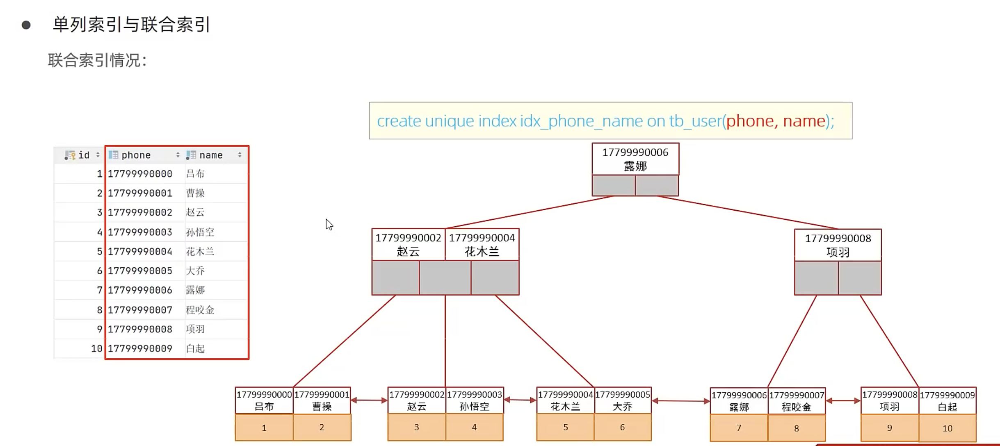

# 索引使用

## 验证索引效率

### 1. 创建索引前

在有一千万条数据的表中，通过 SELECT 语句查询未建立索引的字段，查看 SQL 的耗时（20s）。

```sql
SELECT * FROM tb_sku WHERE sn = '100000003145001';
```

### 2. 创建索引

针对 `sn` 字段创建索引（常规索引）：

```sql
CREATE INDEX idx_sku_sn ON tb_sku(sn);
```

### 3. 创建索引后，消费索引

再次执行相同的 SQL 语句，查看 SQL 的耗时，并与创建索引前进行比较（0.1s）。

```sql
SELECT * FROM tb_sku WHERE sn = '100000003145001';
```


## 联合索引

### 最左前缀法则（主要用于联合索引）

最左前缀法则是指：利用联合索引进行前缀定位时，通常需要从索引定义的最左列开始，连续匹配后续列。如果缺少索引定义的最左列，则无法使用该联合索引进行前缀定位；如果只是跳过索引定义的中间某一列，那么这一列之后的列则不能进行前缀定位。

**这里的“最左”和“连续”指联合索引中的列顺序，与 WHERE 中用 AND 连接的条件的书写顺序无关。**

以下示例沿用按 `(profession, age, status)`字段顺序建立的联合索引：

```sql
EXPLAIN SELECT * FROM tb_user WHERE profession = '软件工程' AND age = 31 AND status = '0'; -- 可利用联合索引的前 3 列进行前缀定位

EXPLAIN SELECT * FROM tb_user WHERE profession = '软件工程' AND age = 31; -- 可利用联合索引的前 2 列进行前缀定位

EXPLAIN SELECT * FROM tb_user WHERE profession = '软件工程'; -- 可利用联合索引的前 1 列进行前缀定位

EXPLAIN SELECT * FROM tb_user WHERE age = 31 AND status = '0'; -- 不可利用联合索引进行前缀定位

EXPLAIN SELECT * FROM tb_user WHERE status = '0'; -- 不可利用联合索引进行前缀定位

EXPLAIN SELECT * FROM tb_user WHERE status = '0' AND profession = '软件工程'; -- 可利用联合索引的前 1 列进行前缀定位，无关顺序

EXPLAIN SELECT * FROM tb_user WHERE age = 31 AND status = '0' AND profession = '软件工程'; -- 可利用联合索引的前 3 列进行前缀定位，无关顺序
```


### 范围定位（主要用于联合索引）

范围查询是指：利用联合索引进行范围定位时，如果某一列使用了 `>` 或 `<`，那么后续列通常不能继续用于范围定位，但仍可能用于过滤；如果使用了 `>=` 或 `<=`，后续列仍可能参与范围定位。

**同样的与联合索引中的列顺序有关，WHERE 中用 AND 连接的条件的书写顺序无关。**

以下示例沿用按 `(profession, age, status)`字段顺序建立的联合索引：

```sql
EXPLAIN SELECT * FROM tb_user WHERE profession = '软件工程' AND age > 30 AND status = '0'; -- 可利用联合索引的前 2 列进行范围定位

EXPLAIN SELECT * FROM tb_user WHERE age > 30 AND status = '0' AND profession = '软件工程'; -- 可利用联合索引的前 2 列进行范围定位，无关顺序

EXPLAIN SELECT * FROM tb_user WHERE status = '0' AND profession = '软件工程' AND age > 30; -- 可利用联合索引的前 2 列进行范围定位，无关顺序

EXPLAIN SELECT * FROM tb_user WHERE profession = '软件工程' AND status = '0' AND age > 30; -- 可利用联合索引的前 2 列进行范围定位，无关顺序

EXPLAIN SELECT * FROM tb_user WHERE profession = '软件工程' AND age >= 30 AND status = '0'; -- 可利用联合索引的前 3 列进行范围定位

EXPLAIN SELECT * FROM tb_user WHERE age >= 30 AND status = '0' AND profession = '软件工程'; -- 可利用联合索引的前 3 列进行范围定位，无关顺序

EXPLAIN SELECT * FROM tb_user WHERE status = '0' AND profession = '软件工程' AND age >= 30; -- 可利用联合索引的前 3 列进行范围定位，无关顺序

EXPLAIN SELECT * FROM tb_user WHERE profession = '软件工程' AND status = '0' AND age >= 30; -- 可利用联合索引的前 3 列进行范围定位，无关顺序
```


## 索引失效

### 索引列运算

不要在索引列上进行运算操作，**索引将失效**。

```sql
EXPLAIN SELECT * FROM tb_user WHERE substring(phone,10,2) = '15'; -- 对 phone 使用函数，无法利用 phone 的普通索引进行定位
```


### 字符串不加引号（注意一下隐式转换）

字符串类型字段使用时，不加引号，**索引将失效**。

```sql
EXPLAIN SELECT * FROM tb_user WHERE profession = '软件工程' AND age = 31 AND status = 0; -- 若 status 为字符串类型，与数字比较会发生隐式转换，使第 3 列无法用于前缀定位；联合索引前 2 列仍可用于定位

EXPLAIN SELECT * FROM tb_user WHERE phone = 17799990015; -- 若 phone 为字符串类型，与数字比较会发生隐式转换，无法利用 phone 索引进行定位
```

**原因说明（前提：`status` 和 `phone` 为 `CHAR`、`VARCHAR` 等字符串类型）：**

字符串与数值比较时，MySQL 会将字符串隐式转换为数值，再进行比较。转换只发生在比较过程中，**不会修改表中存储的原始数据**。

索引按原来的字符串组织，而 `'1'`、`'01'`、`' 1'` 转换为数值后都等于 `1`，因此无法直接利用原来的字符串索引进行定位。

- `status = 0`：`status` 这一列无法参与索引定位，但联合索引 `(profession, age, status)` 的前两列仍可用于定位，并非整个联合索引都失效。
- `phone = 17799990015`：无法利用 `phone` 的普通索引进行定位。
- 写成 `status = '0'` 和 `phone = '17799990015'`，可避免这里的隐式数值转换；如果字段本身是数值类型，则不需要为数值加引号。


### 模糊查询

如果仅仅是尾部模糊匹配，索引不会失效。如果是头部模糊匹配，索引失效。

```sql
EXPLAIN SELECT * FROM tb_user WHERE profession LIKE '软件%'; -- 尾部模糊匹配，可利用索引进行范围定位

EXPLAIN SELECT * FROM tb_user WHERE profession LIKE '%工程'; -- 头部模糊匹配，无法利用索引进行范围定位

EXPLAIN SELECT * FROM tb_user WHERE profession LIKE '%工%'; -- 头尾模糊匹配，因以 % 开头，无法利用索引进行范围定位
```


### OR 连接的条件

用 `OR` 分割开的条件，如果 `OR` 前的条件中的列有索引，而后面的列中没有索引，那么涉及的索引都不会被用到。

```sql
EXPLAIN SELECT * FROM tb_user WHERE id = 10 OR age = 23; -- id 有索引，但 age 无可用索引，无法仅靠 id 索引找全 OR 条件的结果，通常进行全表扫描

EXPLAIN SELECT * FROM tb_user WHERE phone = '17799990017' OR age = 23; -- phone 有索引，但 age 无可用索引，无法仅靠 phone 索引找全 OR 条件的结果，通常进行全表扫描
```

由于 `age` 没有索引，所以即使 `id`、`phone` 有索引，索引也会失效。所以需要针对 `age` 也建立索引。


### 是否使用索引受数据分布影响

如果 MySQL 评估使用索引比全表扫描更慢，则不使用索引。

```sql
SELECT * FROM tb_user WHERE phone >= '17799990005'; -- 若匹配的数据占比较大，MySQL 可能认为全表扫描成本更低，从而不使用 phone 索引

SELECT * FROM tb_user WHERE phone >= '17799990015'; -- 若匹配的数据占比较小，MySQL 可能选择使用 phone 索引进行范围扫描
```

是否使用索引取决于实际数据分布和优化器的成本估算，并非由上述手机号固定决定；可在语句前加 `EXPLAIN` 查看执行计划。


## SQL 提示

SQL 提示是优化数据库的一个重要手段。简单来说，就是在 SQL 语句中加入一些人为的提示，以达到优化操作的目的。

比例当前 SELECT 语句的条件字段有两个匹配的索引（单列索引、联合索引），默认情况下优化器会优先选择联合索引，但是我们想要它使用的是单列索引怎么办？那么就使用 SQL 提示。

### 1. USE INDEX（对于优化器来说这是一个建议，它可以不接受）

```sql
EXPLAIN SELECT * FROM tb_user USE INDEX(idx_user_pro) WHERE profession = '软件工程'; -- 限定用于查找行的候选索引为 idx_user_pro，但优化器仍可选择全表扫描（受数据分布影响）
```

### 2. IGNORE INDEX（对于优化器来说这是一个要求）

```sql
EXPLAIN SELECT * FROM tb_user IGNORE INDEX(idx_user_pro) WHERE profession = '软件工程'; -- 忽略 idx_user_pro 索引，优化器可选择其他可用索引或全表扫描（受数据分布影响）
```

### 3. FORCE INDEX（对于优化器来说这是一个要求）

```sql
EXPLAIN SELECT * FROM tb_user FORCE INDEX(idx_user_pro) WHERE profession = '软件工程'; -- 限定候选索引并将全表扫描视为高成本；只有指定索引无法用于查找行时，才考虑全表扫描（不受数据分布影响）
```


## 覆盖索引

减少 `SELECT *`，尽量使用覆盖索引（查询使用了索引，并且需要返回的列在该索引中已经全部能够找到，不需要回表查询其他字段列）。

以下示例沿用联合索引 `(profession, age, status)`，假设使用 InnoDB，且 `id` 为主键。InnoDB 的二级索引中包含主键值，因此该联合索引也能提供 `id`。

```sql
EXPLAIN SELECT id, profession FROM tb_user WHERE profession = '软件工程' AND age = 31 AND status = '0'; -- 使用该联合索引时，条件列和返回列均在索引中，属于覆盖索引，无需回表

EXPLAIN SELECT id, profession, age, status FROM tb_user WHERE profession = '软件工程' AND age = 31 AND status = '0'; -- 使用该联合索引时，所需列全部能从索引中取得，无需回表

EXPLAIN SELECT id, profession, age, status, name FROM tb_user WHERE profession = '软件工程' AND age = 31 AND status = '0'; -- name 不在该联合索引中，使用该索引定位后，还需根据主键回表取得 name

EXPLAIN SELECT * FROM tb_user WHERE profession = '软件工程' AND age = 31 AND status = '0'; -- SELECT * 包含 name 等索引未覆盖的列，使用该联合索引时需要回表
```

**知识小贴士：**

- `using index condition`：查找使用了索引，但是需要回表查询数据
- `using where; using index`：查找使用了索引，但是需要的数据都在索引列中能找到，所以不需要回表查询数据

补充说明：以上内容出现在 `EXPLAIN` 执行计划的 **`Extra` 字段（额外信息）**中。

### 覆盖索引与回表查询示例

假设 `tb_user` 使用 InnoDB，`id` 为主键，`name` 上建立了二级索引（辅助索引），示例数据如下：

| id | name | gender | createdate |
| --- | --- | --- | --- |
| 2 | Arm | 1 | 2021-01-01 |
| 3 | Lily | 0 | 2021-05-01 |
| 5 | Rose | 0 | 2021-02-14 |
| 6 | Zoo | 1 | 2021-06-01 |
| 8 | Doc | 1 | 2021-03-08 |
| 11 | Lee | 1 | 2020-12-03 |

- **聚集索引（`id`）**：叶子节点保存整行数据，可根据主键直接取得该行的所有字段。
- **辅助索引（`name`）**：叶子节点包含 `name` 和对应的主键 `id`，不包含 `gender`、`createdate`。

**1. 通过主键查询整行数据**

```sql
SELECT * FROM tb_user WHERE id = 2; -- 直接通过聚集索引取得整行数据，无需先查辅助索引再回表
```

查询过程：在 `id` 的聚集索引中找到 `id = 2` 的记录，直接返回 `(2, Arm, 1, 2021-01-01)`。

**2. 使用覆盖索引查询**

```sql
SELECT id, name FROM tb_user WHERE name = 'Arm'; -- 使用 name 辅助索引时，所需的 id、name 都在索引中，无需回表
```

查询过程：在 `name` 的辅助索引中找到 `Arm`，同时取得主键 `id = 2`，直接返回 `(2, Arm)`。

**3. 使用辅助索引后回表查询**

```sql
SELECT id, name, gender FROM tb_user WHERE name = 'Arm'; -- gender 不在 name 辅助索引中，使用该索引找到 id 后，还需回表取得 gender
```

查询过程：先在 `name` 的辅助索引中找到 `Arm`，取得主键 `id = 2`；再根据 `id = 2` 查找聚集索引，取得 `gender = 1`，最终返回 `(2, Arm, 1)`。

**回表查询**就是先通过二级索引取得主键，再根据主键查询聚集索引，获取二级索引中没有的数据。上述过程按使用相应索引说明，实际执行计划由优化器决定。

### 覆盖索引练习

一张表有四个字段（`id`、`username`、`password`、`status`）。由于数据量大，需要对以下 SQL 语句进行优化，该如何进行才是最优方案？

```sql
SELECT id, username, password FROM tb_user WHERE username = 'itcast'; -- 按 username 查询，返回 id、username、password 三个字段
```

答案是联合索引。


## 前缀索引

**当字段类型为字符串（`varchar`、`text` 等）时，有时候需要索引很长的字符串，这会让索引变得很大，查询时浪费大量的磁盘 IO，影响查询效率**。此时可以只将字符串的一部分前缀建立索引，这样可以大大节约索引空间，从而提高索引效率。

### 1. 语法

```sql
CREATE INDEX idx_xxxx ON table_name(email(n)); -- 对 email 字段的前 n 个字符建立前缀索引（此处为字符串字段的语法模板）
```

### 2. 前缀长度

可以根据索引的选择性来决定，而选择性是指不重复的索引值（基数）和数据表的记录总数的比值。索引选择性越高则查询效率越高，唯一索引的选择性是 1，这是最好的索引选择性，性能也是最好的。

```sql
SELECT COUNT(DISTINCT email) / COUNT(*) FROM tb_user; -- 计算完整 email 的选择性：不重复的 email 数量 / 总记录数

SELECT COUNT(DISTINCT SUBSTRING(email, 1, 5)) / COUNT(*) FROM tb_user; -- 计算 email 前 5 个字符的选择性：不重复的前缀数量 / 总记录数

-- 看以上两个sql语句哪个返回的比值大，哪个就最好。当然也不能无脑看比值，也要看字符长度，然后根据你的需求来进行平衡。
```

### 3. 前缀索引查询流程

假设 `tb_user` 使用 InnoDB，`id` 为主键，并对 `email` 的前 5 个字符建立了前缀索引 `email(5)`，示例数据如下：

| id | name | phone | email |
| --- | --- | --- | --- |
| 1 | 吕布 | 17799990000 | lvbu666@163.com |
| 2 | 曹操 | 17799990001 | caocao666@qq.com |
| 3 | 赵云 | 17799990002 | 17799990@139.com |
| 4 | 孙悟空 | 17799990003 | 17799990@sina.com |
| 5 | 花木兰 | 17799990004 | 19980729@sina.com |
| 6 | 大乔 | 17799990005 | daqiao666@sina.com |
| 7 | 露娜 | 17799990006 | luna_love@sina.com |
| 8 | 程咬金 | 17799990007 | chengyaojin@163.com |
| 9 | 项羽 | 17799990008 | xiaoyu666@qq.com |
| 10 | 白起 | 17799990009 | baiqi666@sina.com |

- **聚集索引（`id`）**：叶子节点保存整行数据。
- **辅助索引（`email(5)`）**：叶子节点保存邮箱的前 5 个字符和对应的主键 `id`，例如 `lvbu6 → 1`、`daqia → 6`，不保存完整邮箱。

```sql
SELECT * FROM tb_user WHERE email = 'lvbu666@163.com';
```

使用该前缀索引时，查询过程如下：

1. 取查询邮箱的前 5 个字符，即 `lvbu6`。
2. 在 `email(5)` 的辅助索引中查找 `lvbu6`，取得对应的主键 `id = 1`。
3. 根据 `id = 1` 查找聚集索引，取得整行数据，这一步就是**回表查询**。
4. 核对该行的完整 `email` 是否等于 `lvbu666@163.com`，匹配后返回该行。

返回结果：

| id | name | phone | email |
| --- | --- | --- | --- |
| 1 | 吕布 | 17799990000 | lvbu666@163.com |

**注意：前缀相同，不代表完整邮箱相同。** 例如图中 `id = 3` 和 `id = 4` 的邮箱前缀都是 `17799`；查询这类前缀时，需要回表核对候选记录的完整邮箱，不能只凭前缀判断是否满足等值条件。


## 单列/联合索引

- **单列索引**：一个索引只包含单个列。
- **联合索引**：一个索引包含多个列。

在业务场景中，如果存在多个查询条件，考虑针对查询字段建立索引时，建议建立联合索引，而非分别建立单列索引。

### 单列索引情况

假设 `phone` 和 `name` 分别建立了单列索引 `idx_user_phone`、`idx_user_name`，查询如下：

```sql
EXPLAIN SELECT id, phone, name FROM tb_user WHERE phone = '17799990010' AND name = '韩信';
```

图片中的执行计划如下：

| 字段 | 结果 |
| :-- | :-- |
| id | 1 |
| select_type | SIMPLE |
| table | tb_user |
| partitions | NULL |
| type | const |
| possible_keys | idx_user_phone,idx_user_name |
| key | idx_user_phone |
| key_len | 47 |
| ref | const |
| rows | 1 |
| filtered | 100.00 |
| Extra | NULL |

- `possible_keys`：本次查询可能使用 `idx_user_phone` 或 `idx_user_name`。
- `key`：本次实际选择的是 `idx_user_phone`，并未同时使用两个单列索引。

**多条件查询时，MySQL 优化器会根据估算成本选择执行方案，可能使用单列索引、联合索引，或通过索引合并使用多个索引。图中本次选择了 `idx_user_phone`，但不能据此认为 MySQL 一般优先选择单列索引。通常无需添加 SQL 提示；当实际测试确认其他索引方案更优时，再考虑使用提示干预。**


### 联合索引情况

对 `phone` 和 `name` 建立联合索引，图片中的 SQL 如下：

```sql
CREATE UNIQUE INDEX idx_phone_name ON tb_user(phone, name);
```

这里创建的是**联合唯一索引**，`UNIQUE` 约束针对 `(phone, name)` 的组合，而不是要求两列各自唯一。

假设使用 InnoDB，且 `id` 为主键，图片中的示例数据如下：

| id | phone | name |
| --- | --- | --- |
| 1 | 17799990000 | 吕布 |
| 2 | 17799990001 | 曹操 |
| 3 | 17799990002 | 赵云 |
| 4 | 17799990003 | 孙悟空 |
| 5 | 17799990004 | 花木兰 |
| 6 | 17799990005 | 大乔 |
| 7 | 17799990006 | 露娜 |
| 8 | 17799990007 | 程咬金 |
| 9 | 17799990008 | 项羽 |
| 10 | 17799990009 | 白起 |

#### 联合索引结构图（原截图）



**联合索引的结构：**

- `idx_phone_name` 是一棵 B+Tree，索引键由 `(phone, name)` 共同组成。
- 按索引定义的列顺序排序：先按 `phone` 排序，`phone` 相同时再按 `name` 排序。
- 非叶子节点中的组合键用于导航；叶子节点保存 `phone`、`name` 和对应的主键 `id`，例如 `(17799990000, 吕布) → id = 1`。
- 叶子节点按顺序连接，方便沿索引顺序扫描。

因此，对于前面查询 `id`、`phone`、`name` 的 SQL，**如果优化器选择使用该联合索引，查询条件和返回字段都能从索引中取得，属于覆盖索引，无需回表**。
