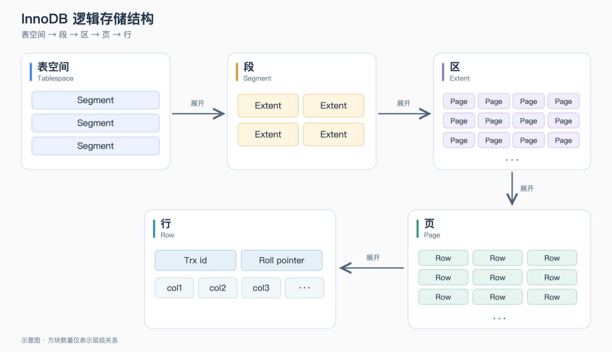

# 逻辑存储结构

表空间：一个 MySQL 实例内可以有多个 InnoDB 表空间，常见的表空间类型有独立表空间、通用表空间等等（额外的：系统表空间、临时表空间）。对于独立表空间和通用表空间，每个 `.ibd` 文件对应一个表空间，用于存储表的数据与索引。

​	**独立表空间**：存放 1 张普通非分区表的数据与索引，或者分区表中 1 个分区的数据与索引。

​	**通用表空间**：可以存放多张表的数据与索引。

**段**：分为数据段（Leaf node segment）、索引段（Non-leaf node segment）、回滚段（Rollback segment）。InnoDB 是索引组织表，数据段用于管理 B+ 树的叶子节点页，索引段用于管理 B+ 树的非叶子节点页。段通过管理区及页来组织存储空间。

**区**：表空间的单元结构，每个区的大小为 1M。默认情况下，InnoDB 存储引擎页大小为 16K，即一个区中一共有 64 个连续的页。

**页**：是 InnoDB 存储引擎磁盘管理的最小单元，每个页的大小默认为 16KB。为了保证页的连续性，InnoDB 存储引擎每次从磁盘申请 4-5 个区。

**行**：InnoDB 存储引擎数据是按行进行存放的。

​	**Trx_id**：每次对某条记录进行改动时，都会把对应的事务 id 赋值给 `trx_id` 隐藏列。

​	**Roll_pointer**：每次对某条记录进行改动时，都会把旧的版本写入到 undo 日志中，然后这个隐藏列就相当于一个指针，可以通	过它来找到该记录修改前的信息。

