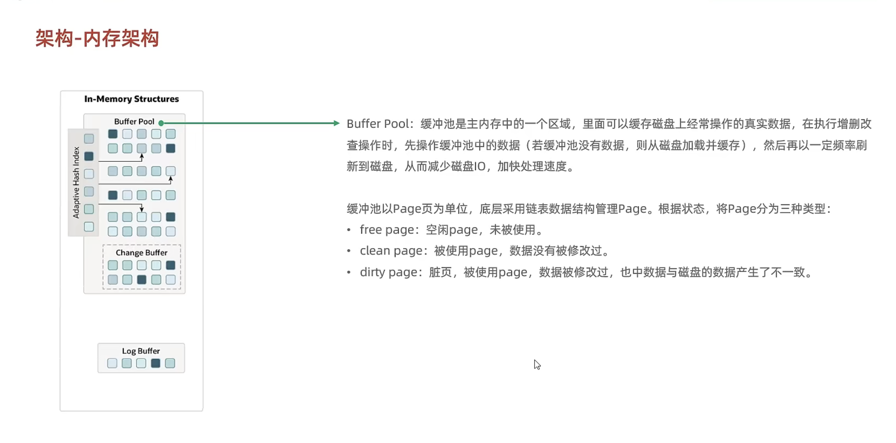
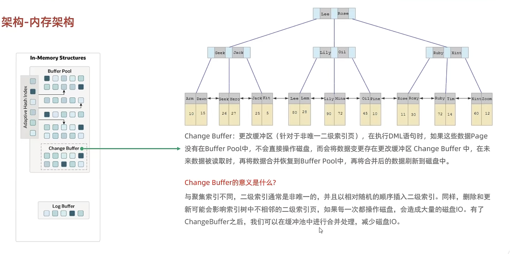
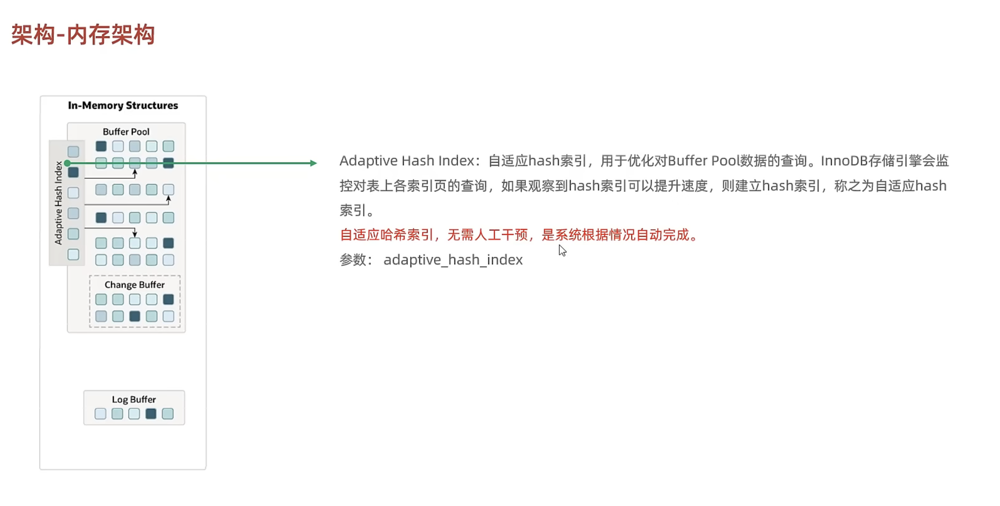
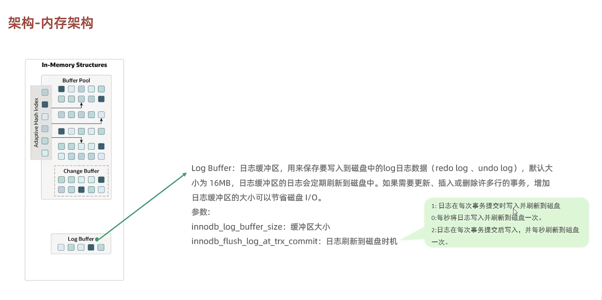
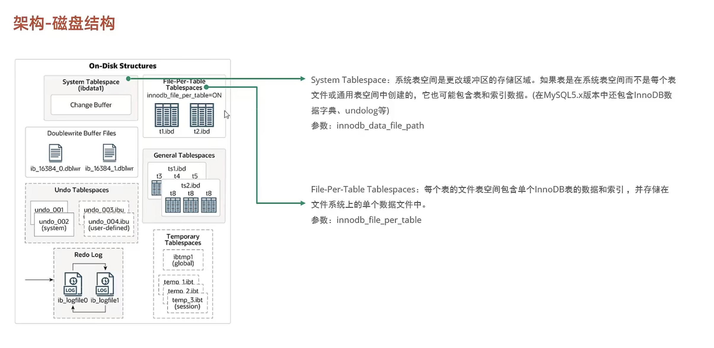
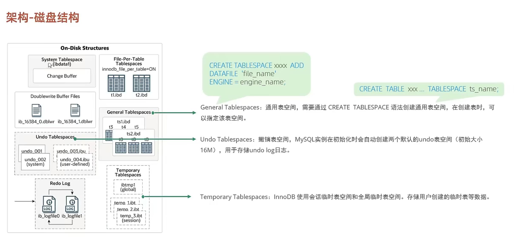
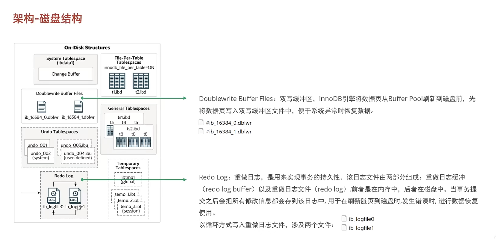
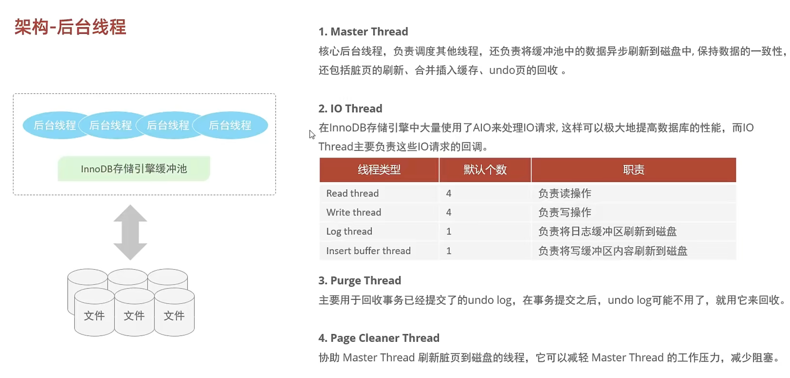
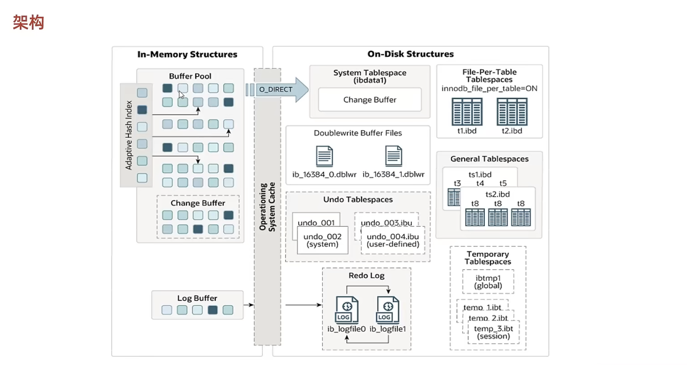

# 架构

MySQL 5.5 版本开始，默认使用 InnoDB 存储引擎，它擅长事务处理，具有崩溃恢复特性，它的架构分为内存结构、磁盘结构。

## 内存架构

### Buffer Pool（缓冲池）

### Change Buffer（更改缓冲区）

### Adaptive Hash Index（自适应哈希索引）

### Log Buffer（日志缓冲区）

## 磁盘结构

### 系统表空间与独立表空间

### 通用表空间、撤销表空间与临时表空间

### 双写缓冲区与重做日志

## 后台线程

## 整体架构

