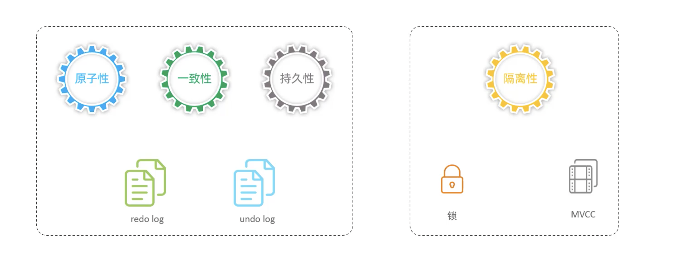
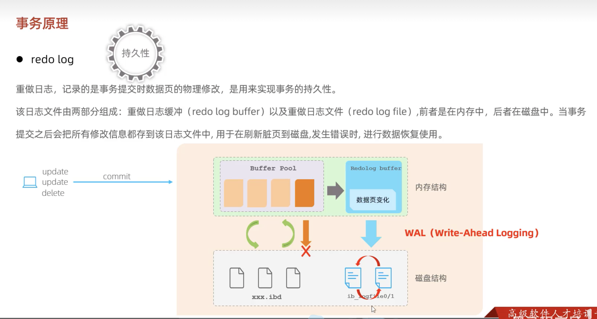
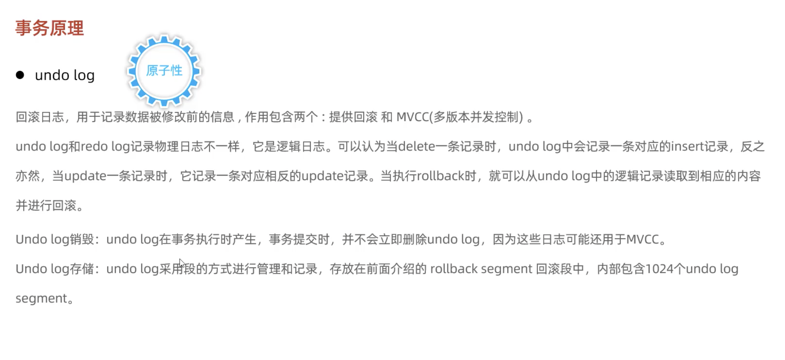

# 事务原理

## 事务

事务是一组操作的集合，它是一个不可分割的工作单位，事务会把所有的操作作为一个整体一起向系统提交或撤销操作请求，即这些操作要么同时成功，要么同时失败。

## 特性

- **原子性（Atomicity）**：事务是不可分割的最小操作单元，要么全部成功，要么全部失败。
- **一致性（Consistency）**：事务完成时，必须使所有的数据都保持一致状态。
- **隔离性（Isolation）**：数据库系统提供的隔离机制，保证事务在不受外部并发操作影响的独立环境下运行。
- **持久性（Durability）**：事务一旦提交或回滚，它对数据库中的数据的改变就是永久的。

所以这两种日志使用的时机不一样，redo log储存的是修改后的数据，在内存缓冲区的数据更新到磁盘的过程中失败的时候使用；而undo log储存的是一个事务的sql语句操作之前的旧值等必要信息，在事务`ROLLBACK`或者事务回滚、MVCC读取旧版本的时候来执行反向操作恢复数据。
